# Personal Portfolio 💼

A fully responsive personal portfolio website built with HTML, CSS, and JavaScript to showcase projects, experience, and skills. The site features modern styling, smooth animations, and a dark mode toggle for an engaging and professional user experience across all devices. Built to highlight my capabilities as a front-end developer with clean, maintainable code.

## Features ✅

- **Responsive Design** – Optimized for desktop, tablet, and mobile
- **Smooth Animations** – Clean transitions and interactive elements
- **Dark Mode Support** – User-selectable light/dark theme
- **Project Showcase** – Displays key projects with descriptions and links
- **About & Skills Sections** – Highlights experience and technical strengths
- **Contact Section** – Easy way for visitors to get in touch

## 🎬 Site Demo

**[▶ Watch site walkthrough](./docs/portfolio-demo.mp4)** (~1 min)

Theme switch on the hero → education → experience (Freelancer Read More, then slow scroll through DEPI) → skills → projects (Huraymila Read More, Summarize, and video preview) → testimonials (Safar Alshahrani) → awards → contact.

---

## 📸 Screenshots

<table>
  <tr>
    <td width="50%" valign="top">
      <strong>Hero</strong> 
      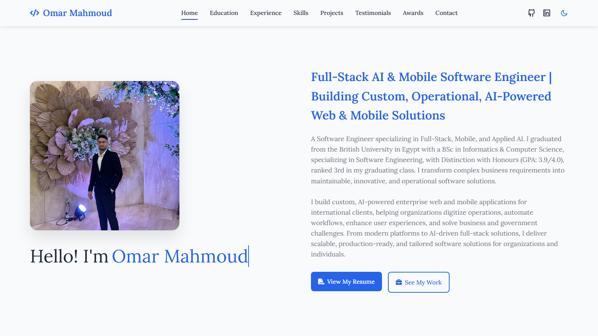
    </td>
    <td width="50%" valign="top">
      <strong>Education</strong> 
      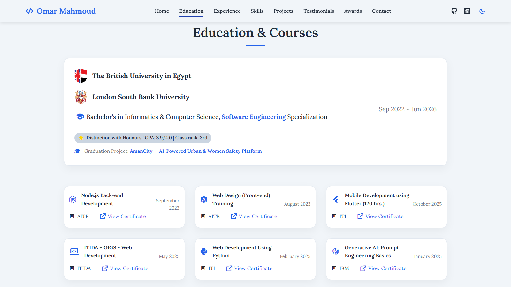
    </td>
  </tr>
  <tr>
    <td width="50%" valign="top">
      <strong>Experience</strong> 
      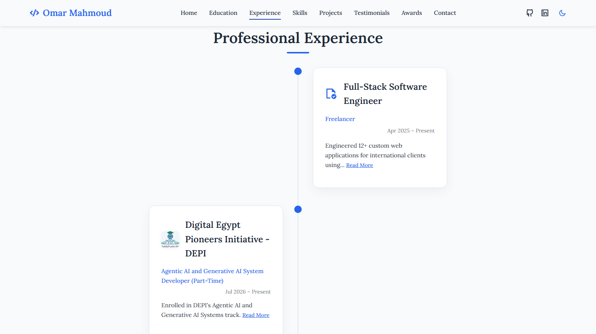
    </td>
    <td width="50%" valign="top">
      <strong>Freelancer Read More</strong> 
      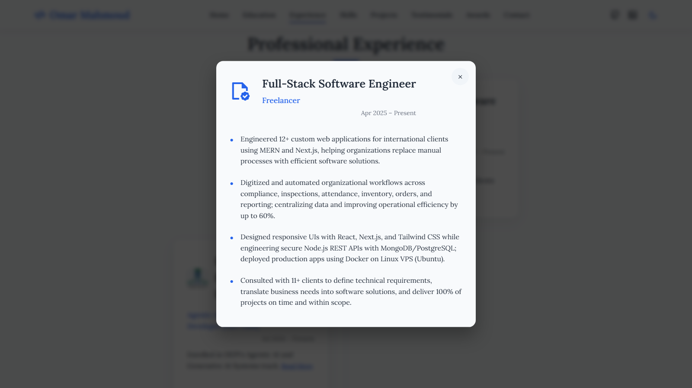
    </td>
  </tr>
  <tr>
    <td width="50%" valign="top">
      <strong>Skills</strong> 
      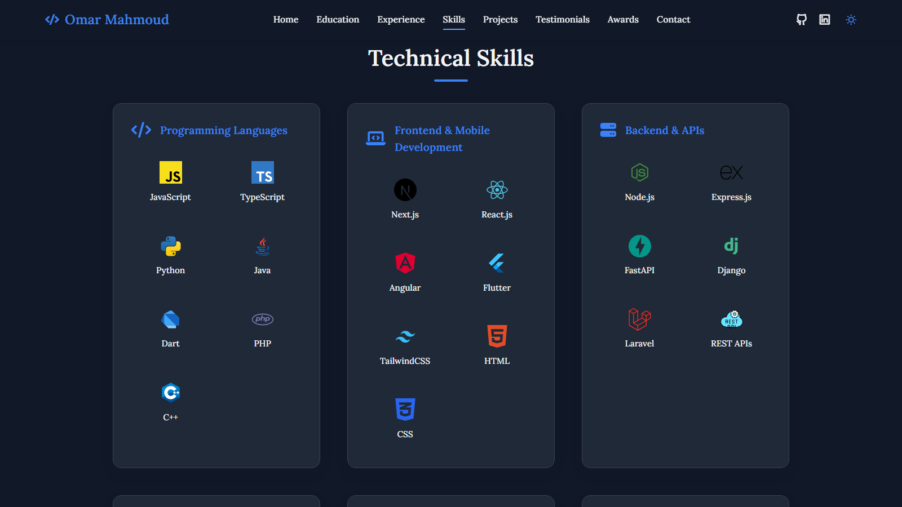
    </td>
    <td width="50%" valign="top">
      <strong>Projects</strong> 
      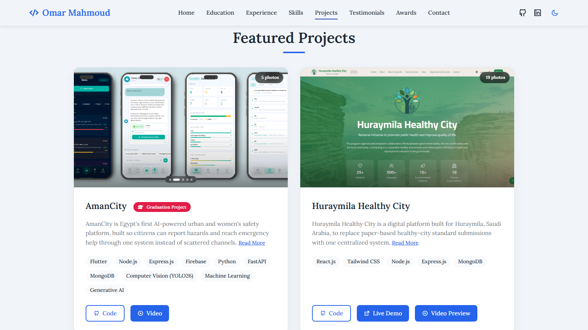
    </td>
  </tr>
  <tr>
    <td width="50%" valign="top">
      <strong>Huraymila Healthy City</strong> 
      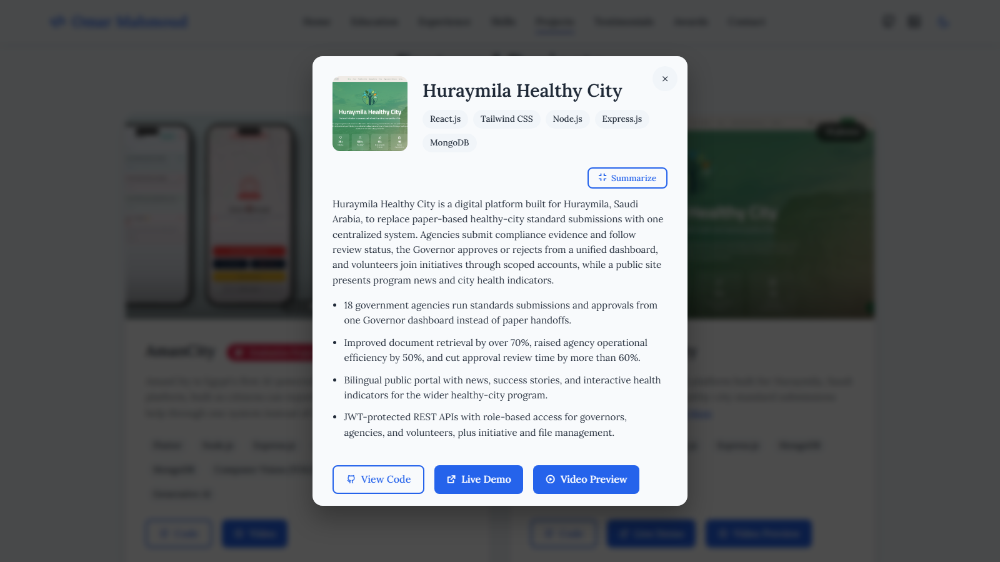
    </td>
    <td width="50%" valign="top">
      <strong>Testimonials</strong> 
      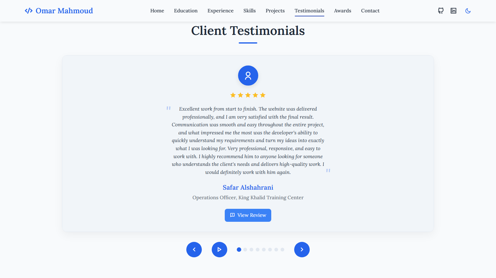
    </td>
  </tr>
  <tr>
    <td width="50%" valign="top">
      <strong>Awards</strong> 
      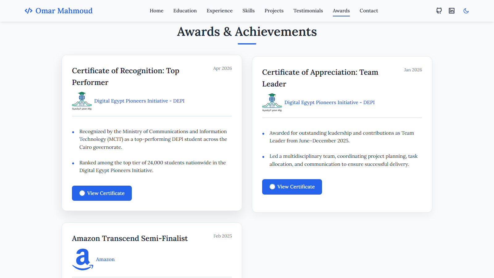
    </td>
    <td width="50%" valign="top">
      <strong>Contact</strong> 
      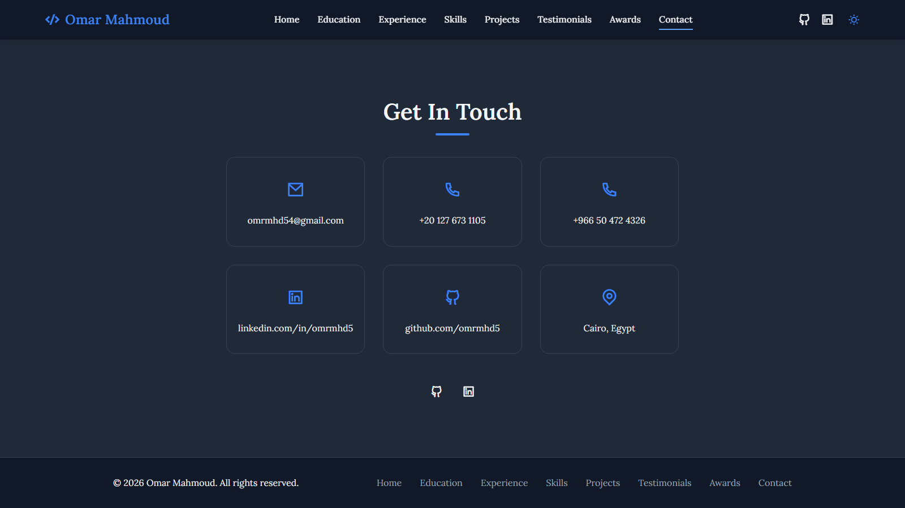
    </td>
  </tr>
  <tr>
    <td width="50%" valign="top">
      <strong>Mobile Hero</strong> 
      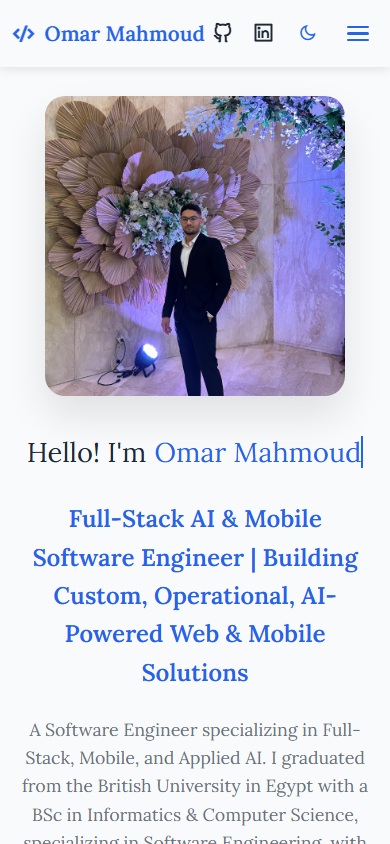
    </td>
    <td width="50%" valign="top"></td>
  </tr>
</table>

## Technologies Used 🛠️

- **HTML** – Structure
- **CSS** – Styling and responsiveness
- **JavaScript** – Interactivity and dark mode logic

## Live Demo 🚀

[**View Live Demo**](https://omarmahmoud.dev/)

## Author

👤 **Omar Mahmoud**
📧 [omrmhd54@gmail.com](mailto:omrmhd54@gmail.com)
💼 [LinkedIn](https://www.linkedin.com/in/omrmhd5/)
🌐 [Portfolio](https://omarmahmoud.dev/)
🔗 [GitHub](https://github.com/omrmhd5)
